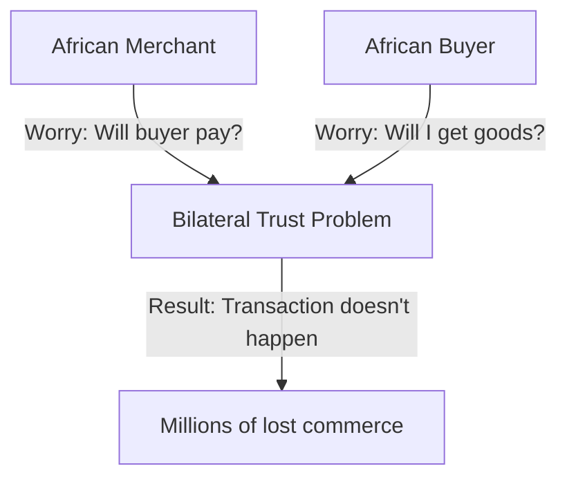
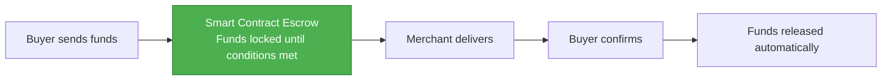
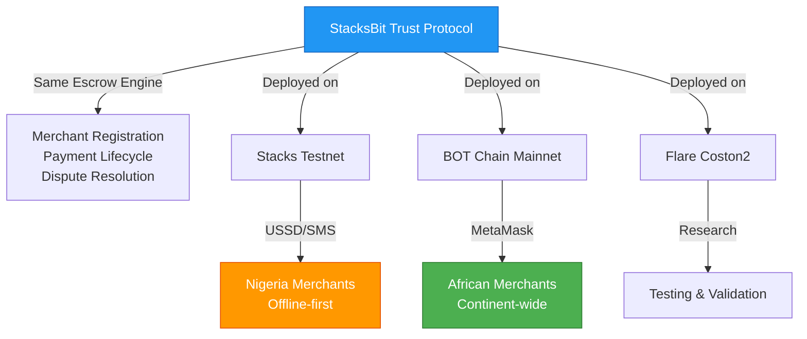
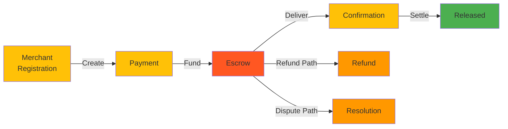
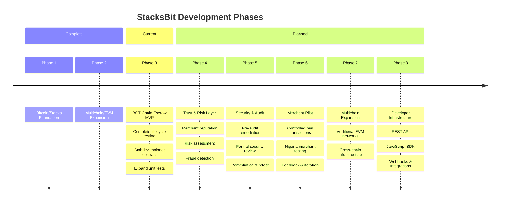
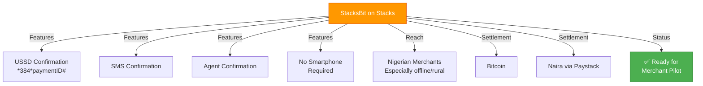
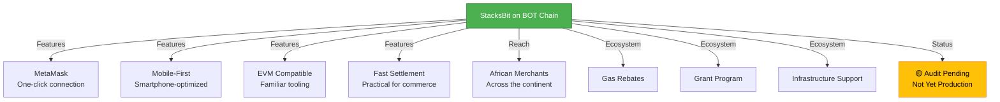
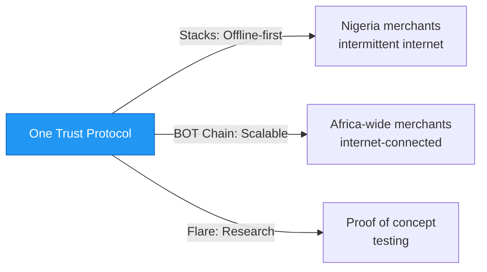

# StacksBit

**Trust Infrastructure for African Commerce**

One Escrow. Multiple Blockchains. Safe Transactions for Africa.

StacksBit is open-source, non-custodial trust infrastructure designed to help African merchants and buyers transact safely using blockchain-based escrow, transparent settlement, risk assessment, and dispute resolution.

---

## The Problem



- **Merchants ask:** How do I know the buyer will actually pay after I send goods?
- **Buyers ask:** How do I know I'll actually receive what I paid for?

Without trust infrastructure, these transactions don't happen.

---

## The Solution



StacksBit uses **blockchain escrow** to solve both risks simultaneously:

- Funds locked in auditable smart contracts
- No company wallet touches merchant money
- Both parties have recourse if dispute occurs
- Settlement is automatic and final
- On-chain reputation prevents repeat bad actors

---

## Architecture: One Protocol, Multiple Blockchains



**Key Principle:** Same trust protocol. Different reach strategies.

- **Stacks Path:** Optimal for offline Nigerian merchants (USSD, SMS, no-internet confirmation)
- **BOT Chain Path:** Scalable reach across Africa (MetaMask, developer APIs, EVM ecosystem)
- **Flare Path:** Reference implementation and multi-chain research

---

## Current Development Status

### BOT Chain Mainnet: Escrow MVP (Phase 3)



**Status:**
- ✅ Smart contract deployed on mainnet
- ✅ Full wallet integration working
- ✅ End-to-end escrow flow tested
- 🟡 Contract unit tests expanding
- 🔴 **NOT approved for real customer funds**
- ⏳ Security audit in progress (Arctek Audits)

---

## Deployment Status

| Environment | Chain ID | Status | Purpose |
|---|---|---|---|
| **BOT Chain Mainnet** | 677 | ✅ Deployed / 🔴 Audit Pending | Primary EVM deployment |
| BOT Chain Testnet | 968 | ✅ Testing | Integration testing |
| Flare Coston2 | 114 | ✅ Historical | Reference deployment |
| Stacks Testnet | — | ✅ Reference | Original Clarity implementation |

### ⚠️ Security Notice

**Deployment ≠ Production Ready**

StacksBit is deployed on BOT Chain Mainnet but **NOT approved for real customer funds**. Pre-audit remediation is in progress. The contract will not accept intentional customer deposits until:

1. Security review completed
2. Audit findings remediated
3. Retest passed
4. Production approval granted

---

## Development Roadmap



---

## Stacks Implementation: Nigeria-First Path



**Target:** Nigerian merchants with intermittent internet, need offline confirmation.

---

## BOT Chain Implementation: Africa-Scale Path



**Target:** African merchants with internet access across the continent.

---

## Why Multichain?



We deploy strategically to **maximize reach across different African markets at different blockchain adoption scales**—not for "multichain" as marketing.

---

## Deployments

**BOT Chain Mainnet:**
- Chain ID: 677
- Contract: `0x7D4d65AA41dA0e321ad52e46E9120F07D55B5284`
- Explorer: https://scan.botchain.ai/address/0x7D4d65AA41dA0e321ad52e46E9120F07D55B5284
- Status: Deployed, audit pending

**BOT Chain Testnet:**
- Chain ID: 968
- Faucet: https://faucet.botchain.ai
- Status: Integration testing

**Stacks Testnet:**
- Status: Ready for merchant pilot

---

## Repository Structure

stacksbit-flare/
├── contracts/
│ └── StacksBitEscrow.sol
├── scripts/
│ ├── deploy.ts
│ ├── test-bot-testnet.ts
│ └── test-bot-mainnet.ts
├── hardhat.config.ts
├── PRE_AUDIT_REMEDIATION.md
└── README.md


---

## Development

### Prerequisites
```bash
Node.js 18+
npm or yarn
Hardhat
```

### Install
```bash
git clone https://github.com/rogersterkaa/stacksbit-flare.git
cd stacksbit-flare
npm install
```

### Compile
```bash
npx hardhat compile
```

### Deploy to BOT Chain
```bash
npx hardhat run scripts/deploy.ts --network botMainnet
npx hardhat verify --network botMainnet 0x7D4d65AA41dA0e321ad52e46E9120F07D55B5284
```

### Test
```bash
npx hardhat test
npx hardhat run scripts/test-bot-mainnet.ts --network botMainnet
```

---

## Frontend

**React Frontend:** https://github.com/rogersterkaa/stacksbit-react  
**Live Demo:** https://stacksbit-react.vercel.app

Supports:
- Stacks wallet integration (Leather, Xverse)
- EVM wallet integration (MetaMask)
- BOT Chain interaction
- Buyer and merchant workflows

---

## Security & Audit

**Auditor:** Arctek Audits (https://arctekaudits.com)  
**Current Status:** Pre-audit remediation in progress  
**Formal Audit:** TBD (funding dependent)

See `PRE_AUDIT_REMEDIATION.md` for detailed security roadmap.

**Principle:** Security is a prerequisite for real customer funds.

---

## Support This Project

If you believe in trust infrastructure for African commerce, sponsor development:

[](https://github.com/sponsors/rogersterkaa)

Your sponsorship helps:
- ✅ Security audits
- ✅ Escrow infrastructure
- ✅ Risk assessment
- ✅ Merchant onboarding
- ✅ Full-time development

---

## Related Repositories

- **Main (BOT Chain):** https://github.com/rogersterkaa/stacksbit-flare
- **Frontend:** https://github.com/rogersterkaa/stacksbit-react
- **Original (Stacks):** https://github.com/rogersterkaa/StacksBit
- **Stacks MCP:** https://github.com/rogersterkaa/stacks-mcp-server

---

## Developer

**Rogers Terkaa**  
Blockchain developer building trust infrastructure for African commerce.

**Email:** rogersterkaa@gmail.com  
**GitHub:** https://github.com/rogersterkaa

---

**Last Updated:** September 11, 2026  
**Mission:** Safe commerce for Africa. One escrow. Multiple blockchains.