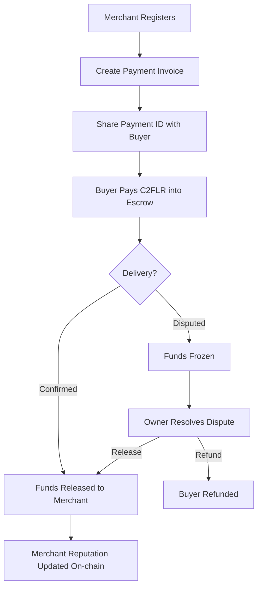
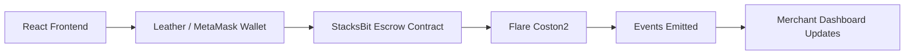

# StacksBit — Flare

**Trust infrastructure for digital commerce. Enabling buyers and merchants who don't know each other to transact safely through blockchain escrow, AI-assisted risk assessment, and interoperable settlement on Flare.**

> **Validated with real merchants in Jos, Nigeria** through the Stacks Foundry Validate program (Q2 2026). Subsequently ported from Stacks to Flare to enable interoperable escrow for digital commerce.

---

## Why This Matters

Every blockchain can move value. Very few solve trust.

Payments answer: *"How do I send money?"*

Commerce asks: *"How do I know the other party won't cheat?"*

StacksBit solves the second problem.

---

## The Problem

Commerce breaks down when trust is missing. Across Africa, buyers fear paying for goods they never receive, while merchants fear shipping products without guaranteed payment. Both parties are exposed to fraud because traditional payment systems transfer money but they don't establish trust.

StacksBit is building the trust infrastructure for digital commerce. Using blockchain-based escrow, AI-assisted risk assessment, and transparent settlement, StacksBit enables strangers to transact with confidence rather than hope.

For Flare Summer Signal, StacksBit has been ported from Stacks to Flare, bringing this trust layer to interoperable digital assets and EVM-compatible wallets.

---

## Flare Summer Signal — Hackathon Submission

| Field | Detail |
|-------|--------|
| Track | Bounty 1 — Interoperable Asset Products |
| Network | Flare Coston2 Testnet |
| Contract | `0xd0D794E8ea1B7048a1E0F9afddB188a309EA6F66` |
| Explorer | [View on Flarescan](https://coston2.testnet.flarescan.com/address/0xd0D794E8ea1B7048a1E0F9afddB188a309EA6F66) |
| Demo | https://stacksbit-react.vercel.app |
| Original project | https://github.com/rogersterkaa/StacksBit |

---

## What Existed Before the Hackathon

StacksBit is an existing project — originally built on Stacks (Bitcoin L2) using Clarity smart contracts:

- 9 Clarity contracts deployed on Stacks Testnet covering escrow, merchant registry, and fraud detection
- Full payment lifecycle verified on-chain: register → invoice → pay → confirm delivery → dispute
- React + TypeScript frontend deployed at stacksbit-react.vercel.app
- 5-week structured merchant validation through Stacks Foundry Validate (Q2 2026)
- Real pilot sessions with merchants in Jos, Plateau State, Nigeria
- Every merchant confirmed bilateral fraud pain — both buyers AND merchants get scammed

---

## Hackathon Contributions

For Flare Summer Signal, the following was newly built:

1. **Solidity escrow contract** — complete rewrite of the Clarity trust logic in Solidity, optimized for Flare's EVM environment. Covers merchant registration, payment creation, escrow locking, delivery confirmation, dispute handling, and on-chain reputation scoring.

2. **Flare Coston2 deployment** — contract deployed and verified at `0xd0D794E8ea1B7048a1E0F9afddB188a309EA6F66` with a fully verified end-to-end transaction flow.

3. **Cross-chain trust architecture** — the original StacksBit settles in sBTC on Stacks. The Flare version extends the same trust infrastructure to C2FLR/FLR and, through Flare's FAssets bridge, to bridged BTC and XRP.

---

## How StacksBit Uses Flare

Flare enables StacksBit to extend trust beyond Bitcoin-native assets. While the original implementation settles in sBTC on Stacks, Flare allows the same trust infrastructure to protect transactions involving multiple interoperable assets. This makes it possible for merchants and buyers to transact securely regardless of whether settlement occurs in FLR, bridged BTC, XRP, or future supported assets.

**EVM compatibility** — any EVM wallet (MetaMask, Rabby, etc.) can interact with StacksBit on Flare, dramatically reducing onboarding friction compared to Bitcoin-native wallets.

**FTSO price feeds (next milestone)** — Flare's decentralized oracle provides real-time NGN/FLR exchange rates, allowing Nigerian merchants to price invoices in naira while settling in FLR.

**FAssets integration (roadmap)** — Flare's trust-minimized bridge enables StacksBit to settle in bridged BTC or XRP.

---

## Architecture

### Payment Flow



### Frontend to Blockchain



---

## How the Escrow Works

```
Merchant registers → Creates invoice → Shares Payment ID with buyer
→ Buyer pays C2FLR into escrow → Funds LOCKED on-chain
→ Merchant delivers goods → Buyer confirms → Funds released automatically
→ Dispute? Funds stay locked until resolved
```

Neither party can cheat:
- Merchant cannot take funds without delivering — buyer must confirm
- Buyer cannot claim non-delivery after receiving goods — funds are locked, not refunded automatically
- Both sides are protected by the same contract, enforced by Flare

---

## Contract Functions

| Function | Who calls it | What it does |
|----------|-------------|--------------|
| `registerMerchant(name, email)` | Merchant | Registers business on-chain |
| `createPayment(description)` | Merchant | Creates an invoice, returns Payment ID |
| `payInvoice(paymentId)` | Buyer | Locks C2FLR in escrow |
| `confirmDelivery(paymentId)` | Buyer | Releases funds to merchant (minus 2.5% fee) |
| `raiseDispute(paymentId)` | Buyer or Merchant | Freezes funds pending resolution |
| `resolveDispute(paymentId, refund)` | Owner | Resolves dispute |
| `getRiskScore(merchant)` | Anyone | Returns trust score 0-100 |
| `getMerchant(wallet)` | Anyone | Returns full merchant profile |
| `getPayment(id)` | Anyone | Returns payment details and status |
| `getMerchantCount()` | Anyone | Total registered merchants |
| `getPaymentCount()` | Anyone | Total payments created |
| `getTotalLockedFunds()` | Anyone | Total C2FLR currently in escrow |
| `isMerchantRegistered(wallet)` | Anyone | Check if merchant exists |
| `paymentExists(id)` | Anyone | Check if payment exists |
| `isPaymentCompleted(id)` | Anyone | Check if payment is in terminal state |

---

## Security

StacksBit is designed with security as a core principle, not an afterthought:

- **Escrow prevents premature fund release** — funds are held by the contract, not the merchant. The merchant cannot access funds until the buyer confirms delivery.
- **Only the buyer can confirm delivery** — merchants cannot self-release funds. This is the key trust guarantee.
- **Funds remain locked during disputes** — raising a dispute freezes funds immediately. Neither party can access them until the owner resolves.
- **Custom errors over require strings** — the contract uses Solidity custom errors (`revert NotBuyer()`, `revert WrongStatus()`) for gas efficiency and clarity.
- **On-chain audit trail** — every state change emits a verifiable event. The full payment lifecycle is permanently recorded on Flare.
- **Merchant reputation updates automatically** — dispute count and completed count update on-chain after every transaction, making reputation manipulation difficult.
- **No upgradeable proxy** — the contract is immutable. What is deployed is what runs. No admin can change logic after deployment.

> **Note:** This contract has not yet been formally audited. It is deployed on Coston2 testnet for hackathon purposes. A security audit is planned before mainnet deployment.

---

## Trust & Reputation Engine

Every completed transaction strengthens the merchant's on-chain reputation, while disputes increase risk. Rather than relying on centralized ratings or off-chain databases, StacksBit calculates transparent trust signals directly from blockchain activity.

| Score | Zone | Action |
|-------|------|--------|
| 0–10 | 🟢 Green | Auto-release — clean history |
| 35 | 🟡 Yellow | Extra verification required |
| 60–90 | 🔴 Red | Manual review — high dispute rate |

No black box. No centralized database. Trust, calculated on-chain.

---

## Validated With Real Merchants

StacksBit was validated through **Stacks Foundry Validate** (5-week structured program, Q2 2026) with real merchants in Jos, Plateau State, Nigeria:

| Actor | Type | Signal |
|-------|------|--------|
| Donald Aondoakura (Errandboy Logistics) | Merchant | Completed walkthrough, asked "what do I do next?" |
| Elias Ahile (Brisk Global) | Merchant | Multiple follow-up calls, asked about dispute resolution |
| Jaram Comfort Mayat (LiveBetter Fashion) | Merchant | Confirmed fraud pain, willing to adopt |
| Lucy Ejembi | Buyer | Opened app independently, explored flow without prompting |
| Tristan Linardos (Founder, Lorica Labs) | Ecosystem | Sustained architectural engagement |
| Parth Goel | Web3 Builder | Deep technical feedback on escrow/reputation architecture |

The most important outcome of validation was a product reframe. We entered Validate believing we were building merchant protection. We left realizing we are building trust infrastructure for both sides of every transaction. That insight now shapes the entire product roadmap.

---

## Roadmap

**Today**
- Escrow enforcement on Flare Coston2
- Merchant onboarding and buyer protection
- On-chain reputation scoring
- Dispute resolution logic

**Next**
- FTSO price feeds for NGN/FLR invoicing
- FAssets settlement (bridged BTC, XRP)
- Cross-chain commerce between Stacks and Flare

**Long-term**
- Trust layer for African digital commerce
- Multi-chain settlement across EVM and non-EVM networks
- Identity and reputation network
- AI fraud intelligence layer

---

## On-Chain Evidence

Full escrow flow executed and verified on Coston2 during development:

| Step | Transaction |
|------|------------|
| Register merchant | `0xaddc19cc8e62d8cd237252fe54719e3ab2a4db06aa99a5aae958f8e238b9dd83` |
| Create payment | `0x4332dd249458ff7aee1817f0a29267479382a8bf3fcf45c792273a7a539058db` |
| Pay invoice | `0x8728e52b05449bb16045ae2ba7784a9f01f4c0534b08f46a695ed11438c0ab63` |
| Confirm delivery | `0x037d50650f9752e788f1a99141a761555ba5275d3eca172a754dd2d988fc56a9` |

Risk score after flow: **10 (Low Risk — Green Zone)**

---

## Tech Stack

| Layer | Technology |
|-------|-----------|
| Smart contract | Solidity 0.8.24 |
| Development | Hardhat + TypeScript |
| Network | Flare Coston2 Testnet (Chain ID: 114) |
| Frontend | React + TypeScript (existing, on Stacks) |
| Original contracts | Clarity on Stacks Testnet |

---

## Related Repos

- **Original Clarity contracts:** https://github.com/rogersterkaa/StacksBit
- **React frontend:** https://github.com/rogersterkaa/stacksbit-react
- **Stacks MCP Server:** https://github.com/rogersterkaa/stacks-mcp-server

---

## The Vision

StacksBit started as a Bitcoin escrow platform. Through customer validation and this hackathon, it has evolved into a broader mission: building the trust infrastructure that enables digital commerce to happen safely between strangers regardless of the blockchain or asset being used.

Flare's interoperability makes that vision possible beyond a single ecosystem.

---

## Builder

**Terkaa Tarkighir (Rogers)**  
Blockchain developer — Jos, Plateau State, Nigeria  
📧 rogersterkaa@gmail.com  
🐙 github.com/rogersterkaa  
🔗 stacksbit-react.vercel.app

---

## License

MIT