# StacksBit

## Multichain Trust Infrastructure for Digital Commerce

**One Escrow. Multichain Trust.**

StacksBit is open-source, non-custodial trust infrastructure designed to help buyers and merchants transact more safely using blockchain-based escrow, transparent settlement, risk assessment, and dispute resolution across Bitcoin and compatible blockchain networks.

StacksBit began as a Bitcoin/Stacks escrow project and is evolving into a **multichain trust infrastructure platform**, with EVM implementations including **BOT Chain** and **Flare**, while maintaining the original Stacks implementation as an important reference.

---

## 🧭 Where StacksBit Is Going

Digital commerce has a bilateral trust problem.

**Buyers ask:**

> How do I know the merchant will deliver after I pay?

**Merchants ask:**

> How do I know the buyer will complete payment after I deliver?

StacksBit is being developed to provide a programmable trust layer between the parties.

The long-term vision is to provide reusable infrastructure for:

- Blockchain escrow
- Payment protection
- Transparent settlement
- Dispute resolution
- Transaction risk assessment
- Merchant reputation
- Fraud-prevention capabilities
- Developer APIs and SDKs
- Multichain integrations

The objective is not simply to build another payment application.

> **StacksBit aims to become trust infrastructure that other digital commerce applications can integrate.**

---

# 🚧 Current Development Focus

## BOT Chain Mainnet Escrow MVP

StacksBit is currently focused on completing and stabilizing its **EVM implementation on BOT Chain**.

The BOT Chain Mainnet contract has been deployed and verified on-chain. However, **deployment does not mean production approval**.

The immediate development objective is to complete, test, and secure the full escrow transaction lifecycle:

```text
Merchant Registration
        ↓
Payment Creation
        ↓
Buyer Funding
        ↓
Escrow
        ↓
Merchant Delivery
        ↓
Buyer Confirmation
        ↓
Settlement

with additional paths for:

Escrow
   ├── Settlement
   ├── Refund
   └── Dispute Resolution
Current milestone

Complete and reliably test the full BOT Chain escrow lifecycle before accepting real customer funds.

⚠️ Mainnet Security Notice

StacksBit is deployed on BOT Chain Mainnet, but the production escrow contract is not yet approved for real customer funds.

Pre-audit security remediation is currently in progress.

Formal security review, remediation, retesting, and launch approval are required before real customer deposits are intentionally accepted.

Do not send real funds to the StacksBit escrow contract at this stage.

📊 Deployment & Security Status
Environment	Status	Customer Funds	Details
BOT Chain Mainnet	Deployed & verified	❌ Not approved	Pre-audit remediation / audit pending
BOT Chain Testnet	Testing	❌ No real funds	Integration testing
Flare Coston2	Historical	❌ No real funds	Reference deployment
Stacks Testnet	Reference	❌ No real funds	Original Clarity implementation

Important: Mainnet deployment does not mean production readiness. StacksBit will not intentionally accept real customer funds until the required security review, remediation, retesting, and production approval have been completed.

🏗️ StacksBit Architecture

StacksBit is being designed around a common trust model with blockchain-specific adapters.

Architectural principle

Multichain by architecture, not marketing.

The goal is to maintain a consistent trust model while allowing each blockchain integration to use its native smart-contract and transaction infrastructure.

🌐 Multichain Evolution

StacksBit's development is progressing from an original Bitcoin/Stacks implementation toward a broader multichain architecture.

This evolution does not mean that every transaction must move between blockchains.

Instead, StacksBit aims to make its trust model and infrastructure available across multiple blockchain ecosystems.

🔐 Core Trust Model

At the center of StacksBit is non-custodial escrow.

The system must also account for situations where the transaction does not proceed normally.

The exact contract state transitions are subject to implementation and security review.

🛣️ Development Roadmap

StacksBit is being developed progressively, with security and reliability prioritized before real-world deployment.

Phase 1 — Bitcoin / Stacks Foundation

Status: ✅ Completed

Initial Clarity escrow implementation
Buyer and merchant transaction flows
Smart-contract escrow architecture
Stacks frontend integration
Early product experimentation
Real-world validation

Stacks represents the original Bitcoin-oriented implementation and remains an important reference for the project's evolution.

Phase 2 — Multichain / EVM Expansion

Status: ✅ Completed / In Progress

Flare implementation
EVM-compatible architecture
Solidity escrow implementation
React/TypeScript frontend
MetaMask integration
ethers.js integration
EVM wallet architecture
BOT Chain integration
Objective

Establish an architecture capable of taking the StacksBit trust model beyond a single blockchain ecosystem.

Phase 3 — BOT Chain Escrow MVP

Status: 🚧 Current Focus

Smart Contract
 Stabilize BOT Chain Mainnet contract
 Review contract state transitions
 Complete merchant registration
 Complete payment creation
 Complete payment funding
 Complete escrow lifecycle
 Complete delivery confirmation
 Implement settlement
 Implement refunds
 Implement dispute lifecycle
Frontend
 Stabilize MetaMask integration
 Improve wallet/network detection
 Improve transaction handling
 Display transaction status
 Improve buyer workflow
 Improve merchant workflow
 Improve error handling
Testing
 Expand smart-contract unit tests
 Test complete escrow lifecycle
 Test failure conditions
 Test unauthorized actions
 Test state-transition restrictions
 Test refund paths
 Test dispute paths
 Test frontend/contract integration
Milestone

A complete BOT Chain escrow transaction can reliably progress from merchant registration through payment, funding, delivery, confirmation, and settlement/refund.

Phase 4 — Trust & Risk Layer

Status: 🔜 Planned

Once the core escrow engine is stable, development will expand into transaction-level trust signals.

Planned capabilities include:

 Transaction risk assessment
 AI-assisted risk analysis
 Suspicious transaction detection
 Merchant risk signals
 Merchant reputation
 Dispute evidence infrastructure
 Historical transaction analysis
 Trust scoring
AI safety principle

AI assists; smart contracts enforce.

AI-generated risk assessments should provide signals and recommendations. AI should not have unrestricted authority to move or release customer funds.

Phase 5 — Security & Production Readiness

Status: 🔜 Planned

Security is a prerequisite for real customer funds.

Smart Contract Security
 Comprehensive unit testing
 Integration testing
 Threat modelling
 Access-control review
 State-transition review
 Reentrancy review
 Payment-flow review
 Refund-flow review
 Dispute-flow review
 Edge-case testing
External Security
 Pre-audit remediation
 Formal security review
 External audit
 Remediation of audit findings
 Retesting
 Production readiness review
 Launch approval

StacksBit will not intentionally accept real customer funds until the required security and production-readiness process has been completed.

Phase 6 — Controlled Merchant Pilot

Status: 🔜 Planned

After security readiness, StacksBit will move toward controlled real-world testing.

Planned activities:

 Recruit initial merchants
 Merchant onboarding
 Controlled transactions
 Buyer testing
 Transaction monitoring
 Merchant feedback
 Buyer feedback
 Dispute analysis
 UX improvements
 Reliability measurement

The objective is to validate not only the technology but also whether StacksBit meaningfully reduces trust friction in real commerce.

Phase 7 — Multichain Trust Layer

Status: 🔜 Planned

After the BOT Chain implementation is stable, the architecture can progressively expand across additional networks.

Planned objectives:

 Unified chain adapter architecture
 Consistent escrow interface
 Chain-specific contract adapters
 Multichain transaction monitoring
 Additional EVM networks
 Additional blockchain ecosystems
Phase 8 — StacksBit Developer Infrastructure

Status: 🔭 Long-Term

The long-term objective is to allow third-party applications to integrate StacksBit rather than requiring users to interact directly with a standalone StacksBit application.

Potential infrastructure components:

Escrow API
Payment API
Merchant API
Risk API
Dispute API
Developer SDK
Webhooks
Developer dashboard
Marketplace integrations
🎯 Long-Term Product Vision

The long-term StacksBit architecture can be summarized as:

The destination

StacksBit aims to become a reusable trust layer for digital commerce across blockchain ecosystems.

🧩 Current Product Components
Escrow

Blockchain-based non-custodial escrow designed to protect both sides of a transaction.

Payment Protection

Funds remain subject to defined smart-contract conditions rather than relying solely on bilateral trust.

Transparent Settlement

Transaction state and settlement activity can be verified on-chain.

Dispute Resolution

Transactions can include a defined dispute path rather than assuming every transaction completes normally.

Risk Assessment

Future versions will introduce transaction and merchant risk signals to help identify potentially suspicious activity.

Reputation

Future reputation infrastructure will use transaction history and trust signals to provide additional context around merchants and transactions.

🟢 BOT Chain Mainnet Deployment

Network: BOT Chain Mainnet
Chain ID: 677
Contract Address:

0x7D4d65AA41dA0e321ad52e46E9120F07D55B5284

Explorer:

https://scan.botchain.ai/address/0x7D4d65AA41dA0e321ad52e46E9120F07D55B5284

Status: Deployed and verified on-chain

Last Deploy Transaction:

0xa1728062cd09ce135bb864ed6614b116470cb671508235d6466a8ea3f1002f88

Compiler: Solidity ^0.8.0

Security status: Audit pending. The contract is not approved for real customer funds.

🧪 BOT Chain Testnet

BOT Chain Testnet is available for development and integration testing.

Network: BOT Chain Testnet
Chain ID: 968

Faucet:

https://faucet.botchain.ai

Do not use the BOT Chain Mainnet contract for testing with real funds.

🌐 Networks & Contracts
Network	Chain ID	Contract	Status	Purpose
BOT Chain Mainnet	677	0x7D4d65AA41dA0e321ad52e46E9120F07D55B5284	Deployed	Primary EVM deployment; audit pending
BOT Chain Testnet	968	Available through deployment	Testing	Network/integration testing
Flare Coston2	114	0xd0D794E8ea1B7048a1E0F9afddB188a309EA6F66	Historical	Reference deployment
Stacks Testnet	—	Clarity implementation	Reference	Original implementation
🔐 Security & Audit

Auditor / Security Provider: Arctek Audits

https://arctekaudits.com

Recommended Audit Scope: Package 3 — Critical Path Review

Current Status: Pre-audit remediation in progress; formal audit not yet commissioned.

Detailed remediation work is tracked in:

PRE_AUDIT_REMEDIATION.md
Security commitment

StacksBit is being developed with a security-first approach.

Deployment is not production approval.

No intentional real customer deposits should be accepted until the required security review, remediation, retesting, and production approval have been completed.

📁 Repository Structure
stacksbit-flare/
│
├── contracts/
│   └── StacksBitEscrow.sol
│
├── scripts/
│   ├── deploy.ts
│   ├── test-bot-testnet.ts
│   └── test-bot-mainnet.ts
│
├── hardhat.config.ts
│
├── PRE_AUDIT_REMEDIATION.md
│
└── README.md
# StacksBit

**Trust Infrastructure for African Commerce**

One Escrow. Multiple Blockchains. Safe Transactions for Africa.

StacksBit is open-source, non-custodial trust infrastructure designed to help African merchants and buyers transact safely using blockchain-based escrow, transparent settlement, risk assessment, and dispute resolution.

---

## The Problem

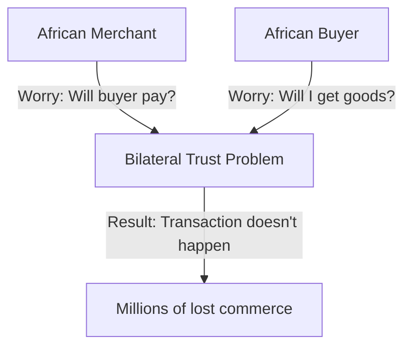

- **Merchants ask:** How do I know the buyer will actually pay after I send goods?
- **Buyers ask:** How do I know I'll actually receive what I paid for?

Without trust infrastructure, these transactions don't happen. Billions in African commerce stays locked.

---

## The Solution

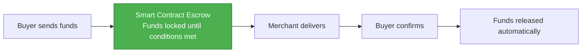

StacksBit uses **blockchain escrow** to solve both risks simultaneously:

- Funds locked in auditable smart contracts
- No company wallet touches merchant money
- Both parties have recourse if dispute occurs
- Settlement is automatic and final
- On-chain reputation prevents repeat bad actors

---

## Architecture: One Protocol, Multiple Blockchains

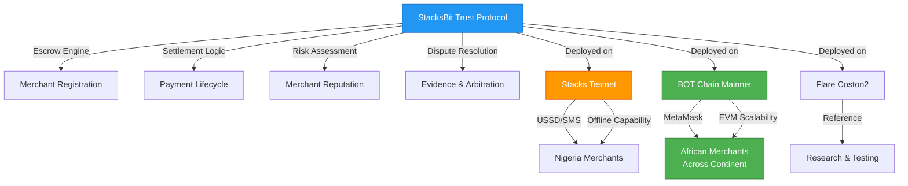

**Key Principle:** Same trust protocol. Different reach strategies.

- **Stacks Path:** Optimal for offline Nigerian merchants (USSD, SMS, no-internet confirmation)
- **BOT Chain Path:** Scalable reach across Africa (MetaMask, developer APIs, EVM ecosystem)
- **Flare Path:** Reference implementation and multi-chain research

---

## Development Roadmap

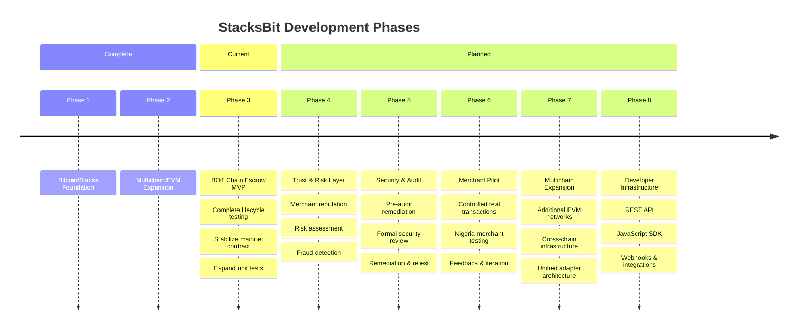

---

## Current Development Status

### BOT Chain Mainnet: Escrow MVP (Phase 3)

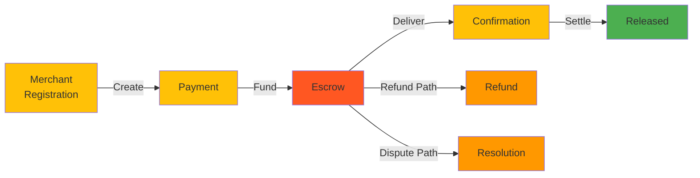

**Status:**
- ✅ Smart contract deployed on mainnet
- ✅ Full wallet integration working
- ✅ End-to-end escrow flow tested
- 🟡 Contract unit tests expanding
- 🔴 **NOT approved for real customer funds**
- ⏳ Security audit in progress (Arctek Audits)

---

## Deployment Status

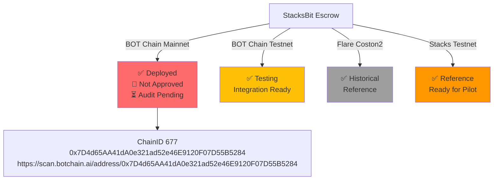

### ⚠️ Security Notice

**Deployment ≠ Production Ready**

StacksBit is deployed on BOT Chain Mainnet but **NOT approved for real customer funds**. 

Pre-audit remediation is in progress. The contract will not accept intentional customer deposits until:
1. Security review completed
2. Audit findings remediated
3. Retest passed
4. Production approval granted

---

## Stacks Implementation: Nigeria-First Path

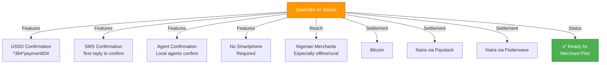

**Target:** Nigerian merchants with intermittent internet, need offline confirmation, prefer local settlement.

---

## BOT Chain Implementation: Africa-Scale Path

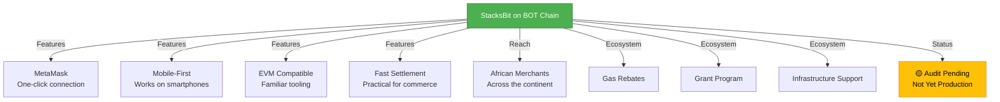

**Target:** African merchants with internet access who want scalable, modern infrastructure.

---

## Why Multichain?

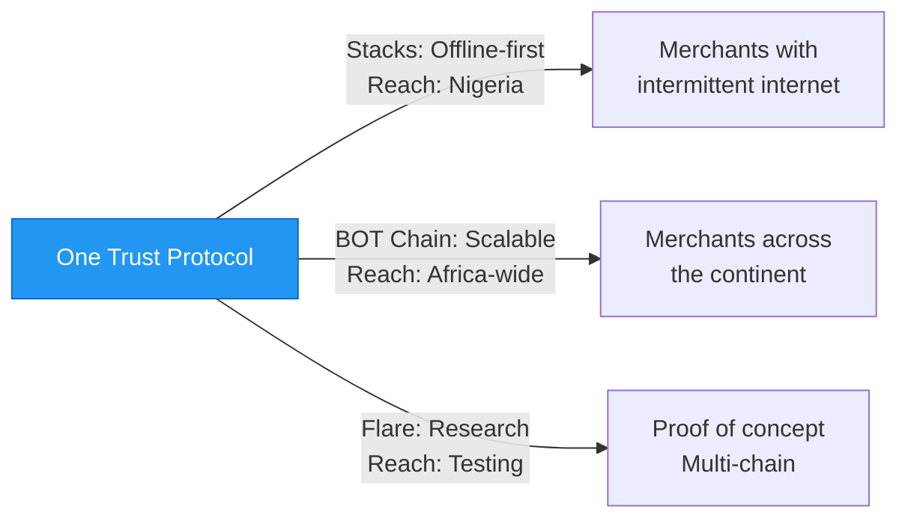

We're not chasing "multichain" as marketing. We're deploying strategically to **maximize reach across different African markets at different blockchain adoption scales**.

---

## Security First

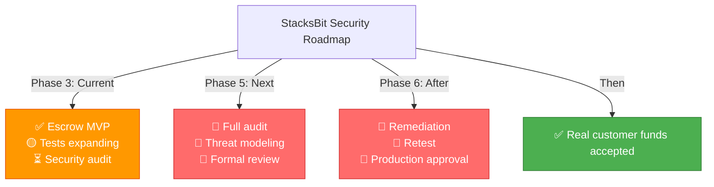

**Principle:** Security is not optional. It's a prerequisite.

---

## Repository Structure

stacksbit-flare/
├── contracts/
│ └── StacksBitEscrow.sol # Main escrow (Solidity)
├── scripts/
│ ├── deploy.ts # BOT Chain deployment
│ ├── test-bot-testnet.ts # Testnet verification
│ └── test-bot-mainnet.ts # Mainnet verification
├── hardhat.config.ts # Network config
├── PRE_AUDIT_REMEDIATION.md # Security roadmap
└── README.md # This file


---

## Development

### Prerequisites
```bash
Node.js 18+
npm or yarn
Hardhat
```

### Install
```bash
git clone https://github.com/rogersterkaa/stacksbit-flare.git
cd stacksbit-flare
npm install
```

### Compile
```bash
npx hardhat compile
```

### Deploy to BOT Chain Mainnet
```bash
npx hardhat run scripts/deploy.ts --network botMainnet
npx hardhat verify --network botMainnet 0x7D4d65AA41dA0e321ad52e46E9120F07D55B5284
```

### Run Tests
```bash
npx hardhat test
npx hardhat run scripts/test-bot-mainnet.ts --network botMainnet
```

---

## Frontend

**React Frontend:** https://github.com/rogersterkaa/stacksbit-react  
**Live Demo:** https://stacksbit-react.vercel.app

Supports:
- Stacks wallet integration
- EVM wallet integration (MetaMask)
- BOT Chain interaction
- Buyer and merchant workflows

---

## Deployments

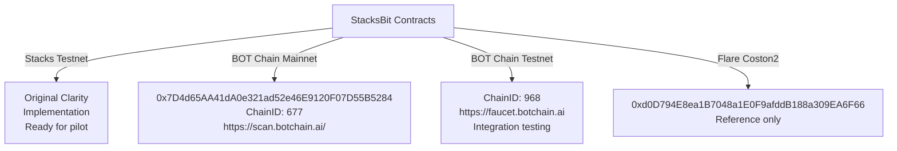

---

## Security & Audit

**Auditor:** Arctek Audits (https://arctekaudits.com)  
**Current Status:** Pre-audit remediation in progress  
**Formal Audit:** TBD (funding dependent)

See `PRE_AUDIT_REMEDIATION.md` for detailed security roadmap.

---

## Support This Project

If you believe in trust infrastructure for African commerce, sponsor development:

[](https://github.com/sponsors/rogersterkaa)

Your sponsorship helps:
- ✅ Security audits
- ✅ Escrow infrastructure
- ✅ Risk assessment
- ✅ Merchant onboarding
- ✅ Full-time development

---

## Developer

**Rogers Terkaa**  
Blockchain developer building trust infrastructure for African commerce.

**Email:** rogersterkaa@gmail.com  
**GitHub:** https://github.com/rogersterkaa  

**Repositories:**
- Main (BOT Chain): https://github.com/rogersterkaa/stacksbit-flare
- Frontend: https://github.com/rogersterkaa/stacksbit-react
- Stacks MCP: https://github.com/rogersterkaa/stacks-mcp-server

---

## Project Status

StacksBit is actively developing with **security and reliability prioritized before real-world deployment**.

**Current Priority:** BOT Chain Escrow MVP → Testing → Security Review → Merchant Pilot → Production

---

**Last Updated:** September 11, 2026  
**Mission:** Safe commerce for Africa. One escrow. Multiple blockchains.